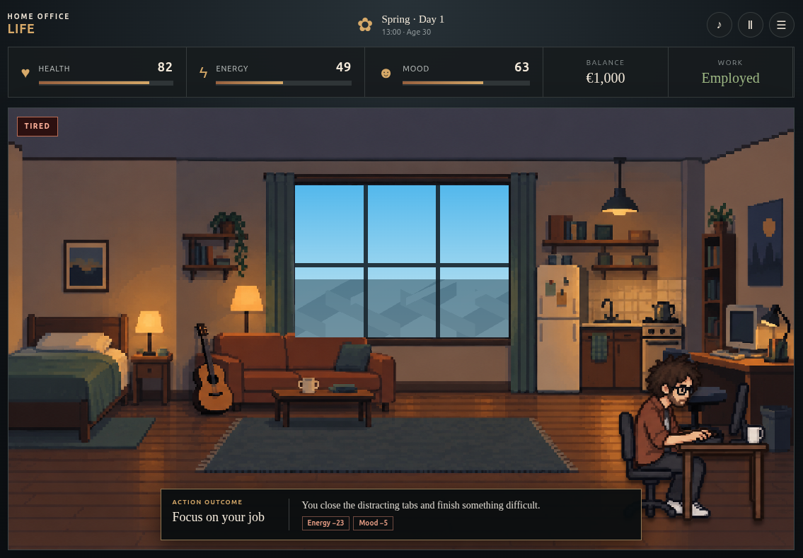

# Home Office Life: Living Life Behind A Window

Can you make the right decisions that will bring your life forward at the right time?
In this game, you will see how time goes by: night and day, seasons, all behind the window of your cozy 1-room apartment.
You are Janus (a name of the Roman god of beginnings, transitions, time, and dualities), a solitary 30-year old man that has a home-office software engineering job, is single, can cook one or two dishes, plays music alone for fun, and has no life plan otherwise. The game will prompt you for decisions and you have to pick the right ones at the right time. These might bring your character into a healthier, happier state, make you earn more money, maybe even find a meaning in life and trascend it. Or it will make Janus crash: sleep poorly, become sick, potentially lose your job, not be able to pay rent and maybe even get kicked out of your only base: your apartment (Game Over).



## The game

Everything happens in a 90s-videogame looking cozy 1 room apartment with: a bed, a couch (with a guitar), a small kitchen area where you can drink coffee, prepare and eat a simple meal, a desktop from where you can connect to the Internet to work (or for other endeavours), and a big window that shows you life outside and how day/night and seasons go by.

You have a health state, an energy state, a mood state, a financial balance and a job situation. By default, at the beginning of the game, your health is good, your energy is balanced, your mood is positive and your financials are +1000 EUR and your job situation is that you have a home-office based job that gives you +100EUR every day. At the end of a game day, you are charged -80EUR in living costs. Game days take around one minute at the default 2× clock speed if you just stay still and do nothing. You are free to choose what do you do next, by choosing with the mouse the part of the apartment that you want to engage with. By doing so, you will be prompted with three actions drawn from a larger catalog. Some staple actions will almost always be there while the others vary randomly. Exhaustion prevents demanding actions, while sleep and simple recovery choices remain available. Choose carefully: poor decisions can now damage Janus's health or finances very quickly.

## How it works

Everything runs locally in the browser. A fixed simulation engine advances time, updates Janus's condition, applies action outcomes, handles work and living costs, and evaluates the different endings. Each part of the apartment has a larger catalog of possible actions, but only three are presented during an interaction. Essential choices remain available while the other slots are randomized, keeping each day varied without making the underlying rules arbitrary.

Most outcomes are predictable: sleeping restores energy, food prevents starvation, work protects income, and recreation or human contact supports mood. A smaller number of explicitly marked chance-based actions, such as trading or publishing a side project, can produce uncertain results. All game state and progress remain on the player's device.

## Basics

The simulation follows several consistent rules:

* Time continuously advances through day, night, and four seasons. A season lasts 10 game days.
* Energy is constrained by time awake and falls close to zero after 16 waking hours. Demanding actions become unavailable when Janus is exhausted.
* Health is constrained by time without food. Eating restores health and permits further recovery; prolonged starvation can be fatal even if Janus sleeps.
* Mood declines through isolation and empty routine. Recreation, creativity, movement, and human contact provide strong mood rewards.
* Work, living expenses, purchases, and risky choices alter the financial balance. Remaining below zero for a full day ends the run.

## Game end

The game ends negatively if Janus remains in debt for a full day, loses his health through prolonged neglect, or spends several days at critically low mood. It ends positively when, after at least 30 days, Janus has built excellent health and mood together with strong financial stability. It ends neutrally if 10 years pass without either outcome.

## Run the playable version

This repository contains the complete offline-first game. It has no external service or account requirements.

```sh
npm start
```

Open <http://localhost:4173>. Progress is saved automatically in the browser. Run the automated checks with `npm test` and `npm run check`.

The simulation includes continuous time, four ten-day seasons, realistic elapsed-hour hunger and sleep pressure, isolation-driven mood decay, visible health/energy/mood outcomes, animated condition and action poses, work and daily finances, a large randomized action catalog that presents three choices at a time, chance outcomes, multiple endings, a journal, clock speeds, pause controls, responsive layouts, and browser-local saves. Proper meals and coffee remain visible in the kitchen, while the desk always offers both the day job and immediate freelance income. Merely eating, working, and sleeping is not enough: Janus needs deliberate recreation, creativity, movement, or human contact to remain well.
